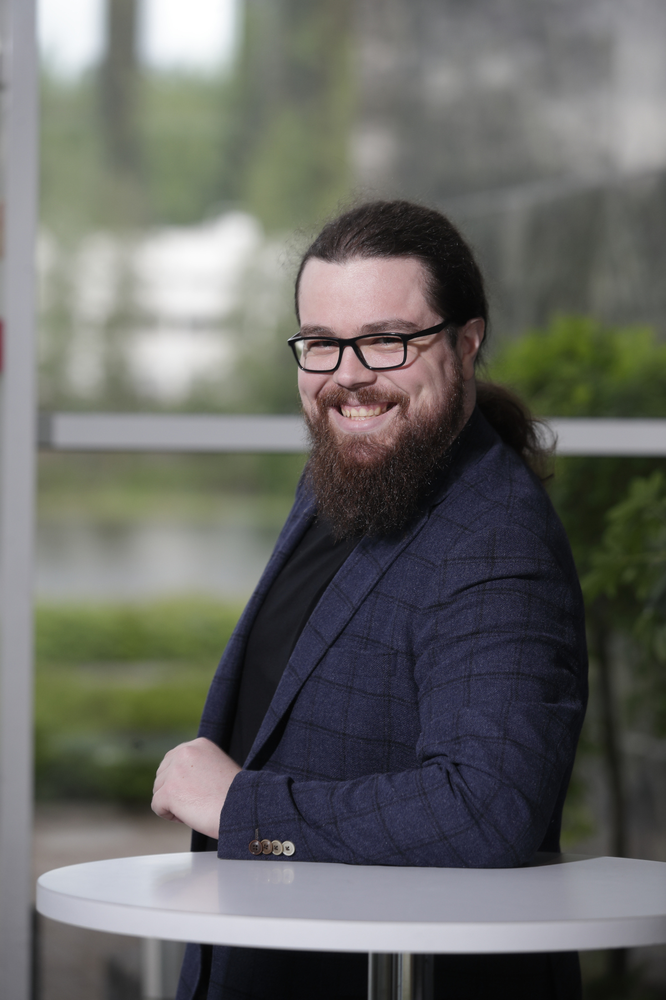

---
hide:
 - navigation
---
{ align=right width="25%" }
# Giovanni Misitano, PhD
## About me
I am currently employed as a post-doctoral researcher at the University of
Jyväskylä, Finland, in the Multiobjectove Optimization Group. I specialize in
methods and tools for multiobjective optimization. These methods can be applied
anywhere with available data, conflicting objectives, and decision makers—that
is pretty much anywhere these days. My current work focuses on researching
decision support tools, more specifically, interactive multiobjective
optimization methods, that are explainable and transparent to decision makers
and stakeholders alike. I also have a deep interest in developing user
interfaces and in the user experience in general from a cognition perspective. 

## Contents

-   :material-clock-fast:{ .lg .middle } __Set up in 5 minutes__

    ---

    Install [`mkdocs-material`](#) with [`pip`](#) and get up
    and running in minutes

    [:octicons-arrow-right-24: Getting started](#)

-   :fontawesome-brands-markdown:{ .lg .middle } __It's just Markdown__

    ---

    Focus on your content and generate a responsive and searchable static site

    [:octicons-arrow-right-24: Reference](#)

-   :material-format-font:{ .lg .middle } __Made to measure__

    ---

    Change the colors, fonts, language, icons, logo and more with a few lines

    [:octicons-arrow-right-24: Customization](#)

-   :material-scale-balance:{ .lg .middle } __Open Source, MIT__

    ---

    Material for MkDocs is licensed under MIT and available on [GitHub]

    [:octicons-arrow-right-24: License](#)

## Links, Social Media, Et Cetera